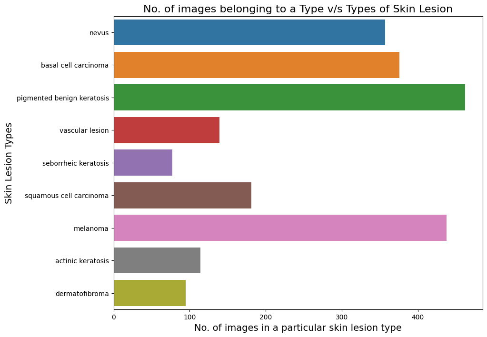
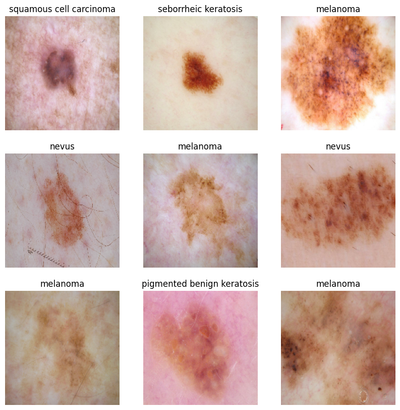
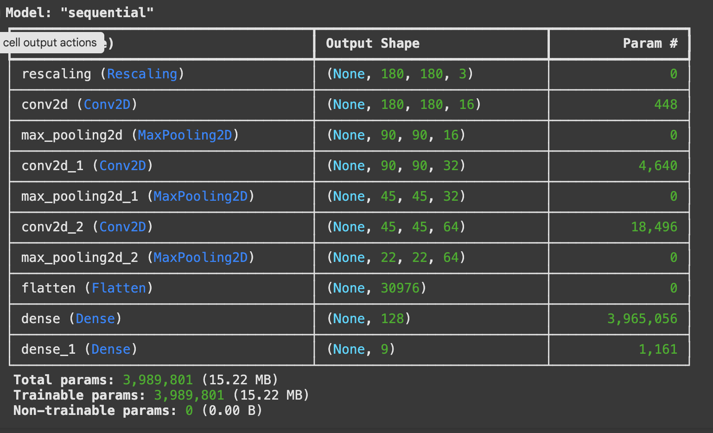
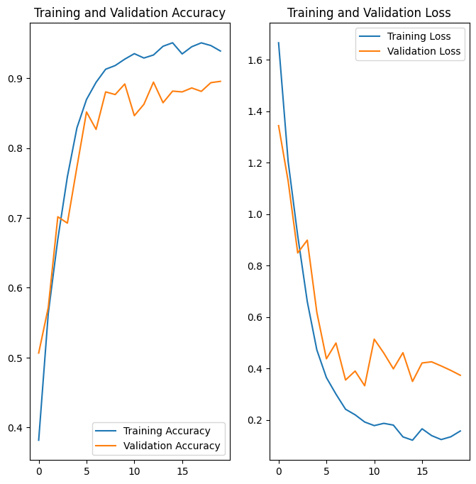

# 🏦 Melanoma Detection Assignment

> Melanoma Skin Cancer Detection Assignment

## Table of Contents
* [Introduction 📑](#introduction)
* [Problem Statement 📑](#problem-statement)
* [Motivation 🎯](#motivation)
* [Objectives 🎯](#objectives)
* [Model Architecture 📝](#model-architecture)
* [Conclusion from the analysis 🔍](#conclusion-from-the-analysis)
* [Technologies Used](#technologies-used)
* [Acknowledgements](#acknowledgements)
* [Contributors](#Contributors)
* [Contact](#Contact)

<!-- You can include any other section that is pertinent to your problem -->
## Introduction

In cancer, there are over 200 different forms. Out of 200, melanoma is the deadliest form of skin cancer. The diagnostic procedure for melanoma starts with clinical screening, followed by dermoscopic analysis and histopathological examination. Melanoma skin cancer is highly curable if it gets identified at the early stages. The first step of Melanoma skin cancer diagnosis is to conduct a visual examination of the skin's affected area. Dermatologists take the dermatoscopic images of the skin lesions by the high-speed camera, which have an accuracy of 65-80% in the melanoma diagnosis without any additional technical support. With further visual examination by cancer treatment specialists and dermatoscopic images, the overall prediction rate of melanoma diagnosis raised to 75-84% accuracy. The project aims to build an automated classification system based on image processing techniques to classify skin cancer using skin lesions images.

## Problem Statement

 In the skin biopsy, the dermatologist takes some part of the skin lesion and examines it under the microscope. The current process takes almost a week or more, starting from getting a dermatologist appointment to getting a biopsy report.
 The aims to shorten the current gap to just a couple of days by providing the predictive model.
 The approach uses Convolutional Neural Network (CNN) to classify nine types of skin cancer from outlier lesions images. This reduction of a gap has the opportunity to impact millions of people positively.

## Motivation

  The overarching goal is to support the efforts to reduce the death caused by skin cancer. The primary motivation that drives the project is to use the advanced image classification technology for the well-being of the people. Computer vision has made good progress in machine learning and deep learning that are scalable across domains.

## Objectives

The dataset consists of 2357 images of malignant and benign oncological diseases, which were formed from the International Skin Imaging Collaboration (ISIC). All images were sorted according to the classification taken with ISIC, and all subsets were divided into the same number of images, with the exception of melanomas and moles, whose images are slightly dominant.

In order to address the challenge of class imbalance, the Augmentor Python package (https://augmentor.readthedocs.io/en/master/) was employed to augment the dataset. This involved generating additional samples for all classes, ensuring that none of the classes had insufficient representation.

The data set contains the following diseases:

- Actinic keratosis
- Basal cell carcinoma
- Dermatofibroma
- Melanoma
- Nevus
- Pigmented benign keratosis
- Seborrheic keratosis
- Squamous cell carcinoma
- Vascular lesion

## Pictorial representation of skin types

The aim of this task is to assign a specific class label to a particular type of skin cancer.

## Model Architecture

The break down of the final provided CNN architecture step by step:

1. **Data Augmentation**: The `augmentation_data` variable refers to the augmentation techniques applied to the training data. Data augmentation is used to artificially increase the diversity of the training dataset by applying random transformations such as rotation, scaling, and flipping to the images. This helps in improving the generalization capability of the model.

2. **Normalization**: The `Rescaling(1./255)` layer is added to normalize the pixel values of the input images. Normalization typically involves scaling the pixel values to a range between 0 and 1, which helps in stabilizing the training process and speeding up convergence.

3. **Convolutional Layers**: Three convolutional layers are added sequentially using the `Conv2D` function. Each convolutional layer is followed by a rectified linear unit (ReLU) activation function, which introduces non-linearity into the model. The `padding='same'` argument ensures that the spatial dimensions of the feature maps remain the same after convolution. The number within each `Conv2D` layer (16, 32, 64) represents the number of filters or kernels used in each layer, determining the depth of the feature maps.
A convolution converts all the pixels in its receptive field into a single value. For example, if you would apply a convolution to an image, you will be decreasing the image size as well as bringing all the information in the field together into a single pixel. 

4. **Pooling Layers**: After each convolutional layer, a max-pooling layer (`MaxPooling2D`) is added to downsample the feature maps, reducing their spatial dimensions while retaining the most important information. Max-pooling helps in reducing computational complexity and controlling overfitting.

5. **Dropout Layer**: A dropout layer (`Dropout`) with a dropout rate of 0.2 is added after the last max-pooling layer. Dropout is a regularization technique used to prevent overfitting by randomly dropping a fraction of the neurons during training.

6. **Flatten Layer**: The `Flatten` layer is added to flatten the 2D feature maps into a 1D vector, preparing the data for input into the fully connected layers.

7. **(Dense Layers) Fully Connected Layers**: Two fully connected (dense) layers (`Dense`) are added with ReLU activation functions. The first dense layer consists of 128 neurons, and the second dense layer outputs the final classification probabilities for each class label.

8. **Output Layer**: The number of neurons in the output layer is determined by the `target_labels` variable, representing the number of classes in the classification task. The output layer does not have an activation function specified, as it is followed by the loss function during training.

9. **Model Compilation**: The model is compiled using the Adam optimizer (`optimizer='adam'`) and the Sparse Categorical Crossentropy loss function (`loss=tf.keras.losses.SparseCategoricalCrossentropy(from_logits=True)`), which is suitable for multi-class classification problems. Additionally, accuracy is chosen as the evaluation metric (`metrics=['accuracy']`).

10. **Training**: The model is trained using the `fit` method with the specified number of epochs (`epochs=50`). The `ModelCheckpoint` and `EarlyStopping` callbacks are employed to monitor the validation accuracy during training. The `ModelCheckpoint` callback saves the model with the best validation accuracy, while the `EarlyStopping` callback stops training if the validation accuracy does not improve for a specified number of epochs (patience=5 in this case). These callbacks help prevent overfitting and ensure that the model converges to the best possible solution.

11. **Activation Function(ReLU)**: The rectified linear activation function or ReLU for short is a piecewise linear function that will output the input directly if it is positive, otherwise, it will output zero.The rectified linear activation function overcomes the vanishing gradient problem, allowing models to learn faster and perform better.

12. **Activation Function(Softmax)**: The softmax function is used as the activation function in the output layer of neural network models that predict a multinomial probability distribution. The main advantage of using Softmax is the output probabilities range. The range will 0 to 1, and the sum of all the probabilities will be equal to one.

## Conclusion from the analysis

### Model Summary

### Model Evaluation

<!-- You don't have to answer all the questions - just the ones relevant to your project. -->

## Technologies Used
- [Python](https://www.python.org/) - version 3.11.4
- [Matplotlib](https://matplotlib.org/) - version 3.7.1
- [Numpy](https://numpy.org/) - version 1.24.3
- [Pandas](https://pandas.pydata.org/) - version 1.5.3
- [Seaborn](https://seaborn.pydata.org/) - version 0.12.2
- [Tensorflow](https://www.tensorflow.org/) - version 2.15.0

<!-- As the libraries versions keep on changing, it is recommended to mention the version of library used in this project -->

## Acknowledgements
Give credit here.
- Upgrad Team and instructors
- [Melanoma Skin Cancer](https://www.cancer.org/cancer/melanoma-skin-cancer/about/what-is-melanoma.html)

- [Introduction to CNN](https://www.analyticsvidhya.com/blog/2021/05/convolutional-neural-networks-cnn/)

- [Image classification using CNN](https://www.analyticsvidhya.com/blog/2020/02/learn-image-classification-cnn-convolutional-neural-networks-3-datasets/)

- [Efficient way to build CNN architecture](https://towardsdatascience.com/a-guide-to-an-efficient-way-to-build-neural-network-architectures-part-ii-hyper-parameter-42efca01e5d7)

## Contributors
 - Madhur Gupta

## Contact
Created by [@guptamadhur](https://github.com/guptamadhur/) - feel free to contact me!

Developed as part of the Exploratory Data Analysis Module required for Post Graduate Diploma in Machine Learning and AI - IIIT, Bangalore by Upgrad.

<!-- Optional -->
<!-- ## License -->
<!-- This project is open source and available under the [... License](). -->

<!-- You don't have to include all sections - just the one's relevant to your project -->
